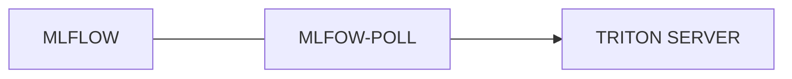

### MlFLOW-POLLING
Project dùng để scan model từ mlflow theo tag để  so sánh với version hiện tại đang được serving trên triton. 
Nếu khác với version đang được serving trên triton. Chạy command của mlflow triton plugin để serving version mới của model

